# IUM zadanie 07 wariant 02
- Korneliusz Litman 310804
- Marcin Zasuwa 311022

# Etap 1

## Kontekst:
> W ramach projektu wcielamy się w rolę analityka pracującego dla portalu „Pozytywka” –serwisu muzycznego, który swoim użytkownikom pozwala na odtwarzanie ulubionych utworów online. Praca na tym stanowisku nie jest łatwa –zadanie dostajemy w formie enigmatycznego opisu i to do nas należy doprecyzowanie szczegółów tak, aby dało się je zrealizować. To oczywiście wymaga  zrozumienia  problemu,  przeanalizowania  danych,  czasami  negocjacji  z  szefostwem. Same  modele musimy skonstruować tak,  aby gotowe  były do  wdrożenia  produkcyjnego – pamiętając,  że  w  przyszłości  będą  pojawiać  się  kolejne  ich  wersje, z  którymi  będziemy eksperymentować.

## Zadanie
> “Gdybyśmy tylko wiedzieli, kiedy użytkownik będzie chciał przesłuchać bieżący utwór w całości, a kiedy go przewinie – moglibyśmy lepiej zorganizować nasz cache”


## Definicja problemu biznesowego
### Kontekst
Serwis muzyczny Pozytywka umożliwia użytkownikom odtwarzanie utworów. Firma zbiera informacje m.in. dotyczączące artystów, utworów czy sesji użytkowników. W celu zwiększenia wydajności i poprawy doświadczeń użytkowników serwis Pozytywka chce ulepszych organizację cache poprzez przewidywanie, kiedy utwory będą odtwarzane w całości, a które będą przewijane

### Zadanie biznesowe
Opracowanie i wdrożenie modelu predykcyjnego, który na podstawie dostępnych danych i historii użytkowników, będzie w stanie przewidywać prawdopodobieństwo, że użytkownik odtworzy utwór w całości lub go przewinie.

### Biznesowe kryteria sukcesu
#### Wariant 1
- Zwiększenie satysfakcji użytkowników poprzez zmniejszenie czasu oczekiwania na załadowanie piosenek
- Priorytetyzowanie cachowania piosenek, które mają większe prawdopodobieństwo, że zostaną odtworzone w całości

#### Wariant 2
- Zwiększenie satysfakcji użytkowników poprzez rekomendowanie im piosenek, na które istnieje mniejsza szansa, że zostaną pominięte
- Zmniejszenie procentowe pomijanych utworów co najmniej o 5%

### Analityczne kryteria sukcesu
Naiwny model, który zawsze przewiduje, że utwór zostanie odtworzony w całości, osiągnie wynik zbliżony do `65.88%` dokładności.
Wynika to z tego, że w dostarczonym zbiorze danych `65.88%` utworów zostało odtworzonych w całości.
Celem jest stworzenie predykcyjnego modelu, który przewiduje z dokładnością wyższą niż `65.88%` prawdopodobieństwo czy utwór zostanie odtworzony w całości, czy zostanie pominięty.

## Definicja zadania / zadań modelowania i wszystkich założeń
Zadania modelowania: Model predykcyjny, który na podstawie dostarczonych danych będzie w stanie przewidzieć, czy utwór zostanie odtworzony w całości, czy zostanie przewinięty.


## Analiza danych
### Przegląd struktury dostarczonych danych
Dostaliśmy dane składające się z 5 plików `jsonl`
- `artists.jsonl` zawiera informacje o artystach
- `sessions.jsonl` zawiera informacje o sesjach użytkowników
- `tracks.jsonl` zawiera informacje o utworach
- `track_storage.jsonl` zawiera informacje o tym na jakich klasach pamięci są przechowywane utwory
- `users.jsonl` zawiera informacje o użytkownikach portalu


#### Wstępne założenia
Aby sprawdzić czy utwór został przesłuchany w całości, czy został pominięty, należy przeanalizować plik `sessions.jsonl`
- podstawowym kryterium analizy jest sprawdzenie czy wystąpił `event_type` *SKIP* pomiędzy `event_type` *PLAY*
- na skipowanie utworów mogą wpływać wartości charakterystyczne dla danych utworów: niektóre utwory mogą być skipowane częściej niż inne
- skipowane utwory mogą też zależeć od preferencji użytkownika np. użytkownik lubi rock, przez co istnieje szansa, że takie utwory będą skipowane przez niego rzadziej


### Analiza za pomocą programów

Do analizy danych wykorzystaliśmy Pythonową bibliotekę `pandas` służącą do analizy danych.

#### Pierwsza wersja
Pierwsza wersja otrzymanych danych zawierała istotne błędy w dużym stopniu utrudniające dalszą analizę.
Większość tych błędów polegała na nullowych i nieprawidłowych wartościach:

##### Raport z analizy
- Artyści (`artists.jsonl`):
    - Wartość -1 dla `id` występuje 494 razy,
    - Brak wartości (`null`) w polu `genres`: 544 wystąpień,
    - Zduplikowane nazwy artystów: 14.

- Sesje (`sessions.jsonl`):

    - Brak wartości (`null`) w polu `event_type`: 167 wystąpień,
    - Brak wartości (`null`) w polu `track_id`: 163 wystąpień,
    - Brak wartości (`null`) w polu `user_id`: 195 wystąpień.

- Utwory (`tracks.jsonl`):

    - Brak wartości (`null`) w polu `id`: 1117 wystąpień,
    - Brak wartości (`null`) w polu `name`: 1083 wystąpień,
    - Brak wartości (`null`) w polu `artist_id`: 1078 wystąpień,
    - Brak wartości (`null`) w polu `popularity`: 1044 wystąpień.

- Użytkownicy (`users.jsonl`):

    - Występuje pole `id` dla jednego rekordu, które nie istnieje dla innych rekordów (wartość pola: -1),
    - Brak wartości (`null`) w polu `favourite_genres`: 5,
    - Brak wartości (`null`) w polu `premium_user`: 1.

- W pliku z danymi o przechowywaniu utworów (`track_storage.jsonl`) nie znaleźliśmy problemów.

#### Druga wersja

##### tracks.jsonl
W danych dalej występują błędy - dla kilku artystów powtarzają się nazwy utworów dla nich samych (występują duplikaty par nazwa utworu - artysta).
Nie jest to sytuacja całkowicie niespotykana, jednak na tyle rzadka, że została uznana za błąd w danych.


Lista duplikatów wraz z ilością wystąpień:
```
Duplicate entries for artist id: 1uNFoZAHBGtllmzznpCI3s and track name: Hold On - 4 occurrences
Duplicate entries for artist id: 6M2wZ9GZgrQXHCFfjv46we and track name: Blow Your Mind (Mwah) - 4 occurrences
Duplicate entries for artist id: 4tpUmLEVLCGFr93o8hFFIB and track name: Atomic - 3 occurrences
Duplicate entries for artist id: 5tOrTQaBRD5yPHqbEwsRn7 and track name: 99 Year Blues - 3 occurrences
...
```
Pełna lista znajduje się w pliku `analysis/analysis_duplicate_track_names.txt`

##### track_storage.jsonl
W porównaniu do pierwszej wersji wszystkie wpisy `track_storage.jsonl` z `track_id` mają odpowiadający id z `tracks.json`

##### sessions.jsonl
- Dane zawierające eventy w sesjach wydają się być poprawne: dla każdego wpisu podany jest odpowiedni `track_id`, który ma odzwierciedlenie w pliku tracks.json (oprócz 3853 eventów typu ADVERTISTMENT lub BUY_PREMIUM, które go nie wymagają)

- Liczba event_type SKIP wynosi 4090, co sugeruje, że odpowiednia wielkość danych wydaje się być zachowana

- Kolejna analiza pokazała, że każdy event_type SKIP jest dla danej sesji poprzedzony (niekoniecznie bezpośrednio) event_type typu PLAY. Czyli dane w tym zakresie wydają się być poprawne. Ta cecha będzie miała kluczowe znaczenie dla naszego zadania (pozwala określić)

- Kolejna analiza pokazała statystyki po jakim czasie utwory są najczęściej pomijane.
```
When track was skipped:
mean: 132.50 seconds
median: 125.88 seconds
min: 0.09 seconds
max: 1057.39 seconds
std: 90.49 seconds

```
- Procentowa liczba pominiętych utworów: `34.12%`

Przygotowaliśmy histogram dla przedstawionych danych:
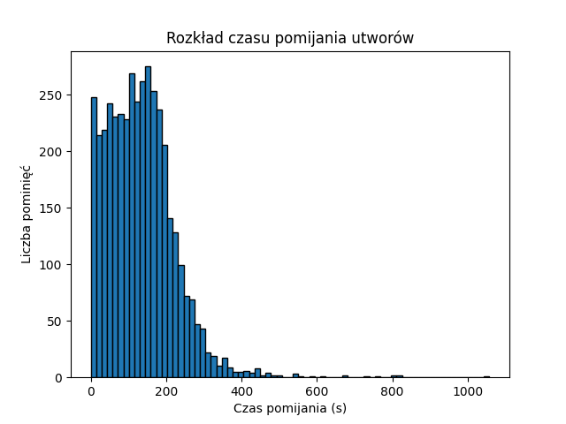


##### tracks.jsonl
Następnie przygotowaliśmy statystyki długości trwania utworów:
```
count    21608
mean       228.06 seconds
std        112.11 seconds
min          4.00 seconds
25%        176.74 seconds
50%        216.51 seconds
75%        262.65 seconds
max       4120.26 seconds
```

Zaznaczyliśmy je na wykresie (zaznaczając dodatkowo 1 i 99 percentyl)
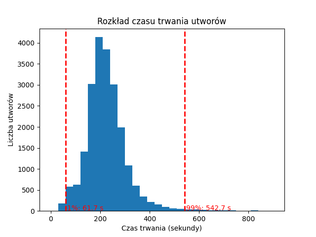

Przygotowaliśmy kolejne histogramy dla kolejnych danych:
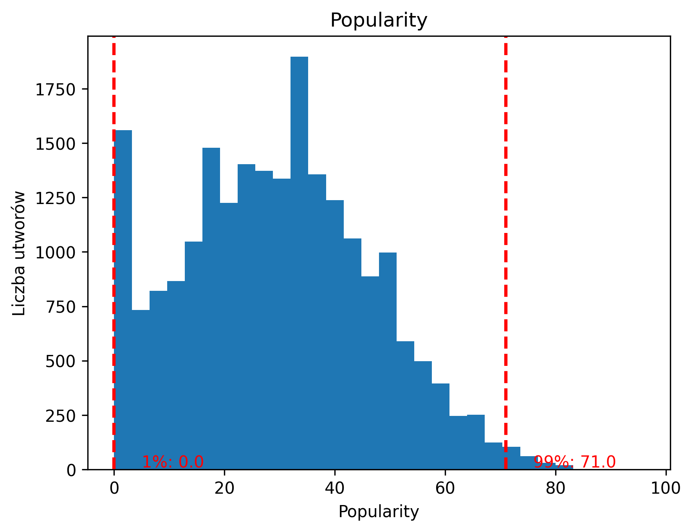

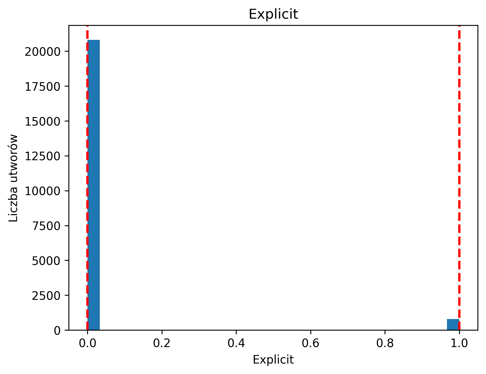


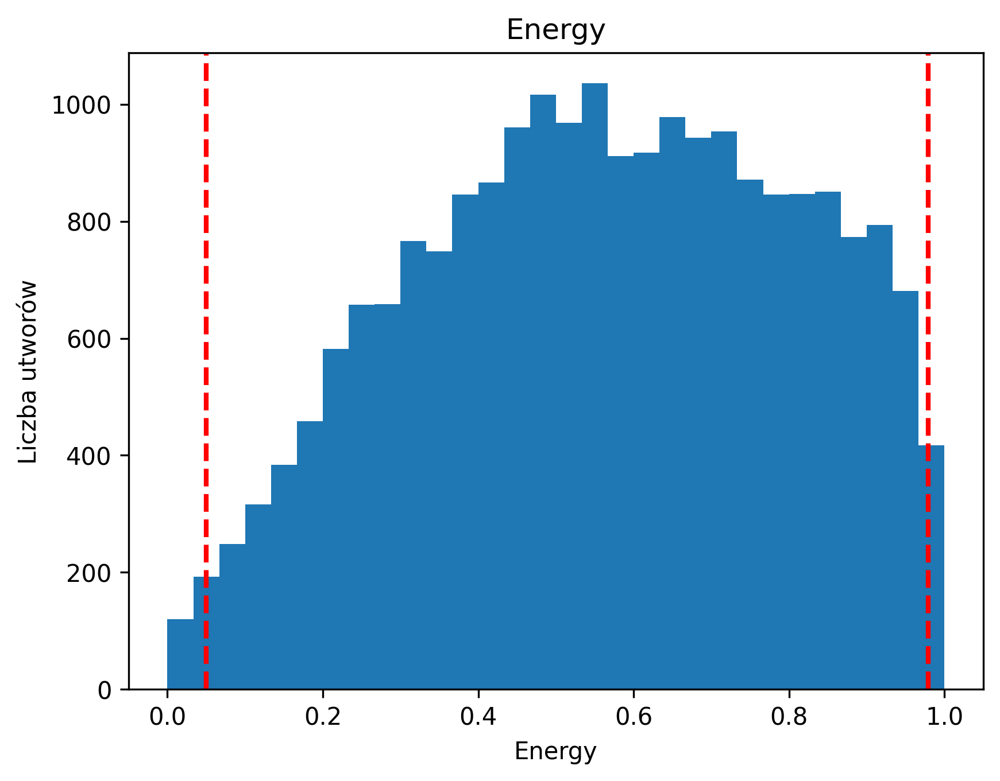

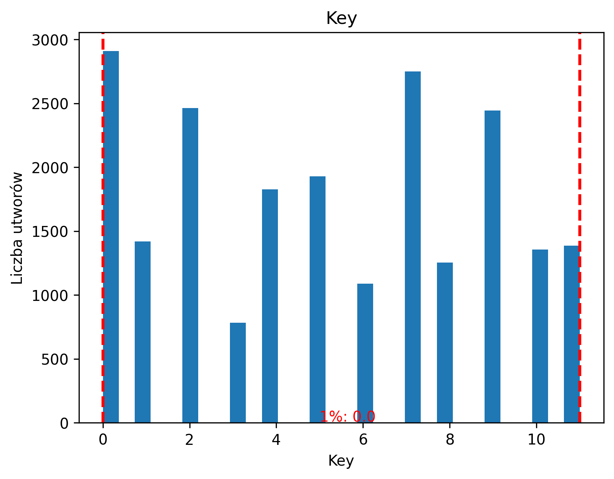

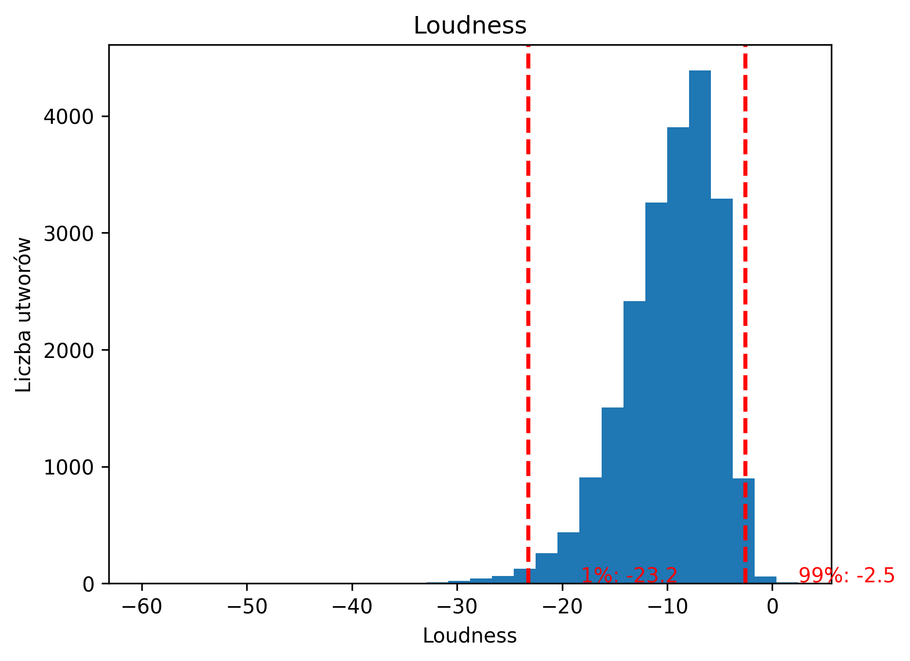

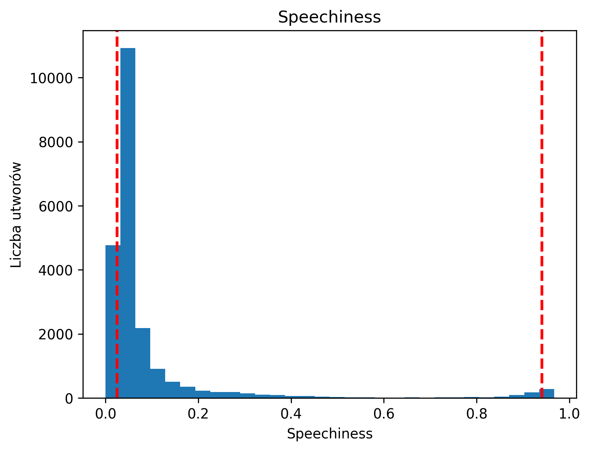

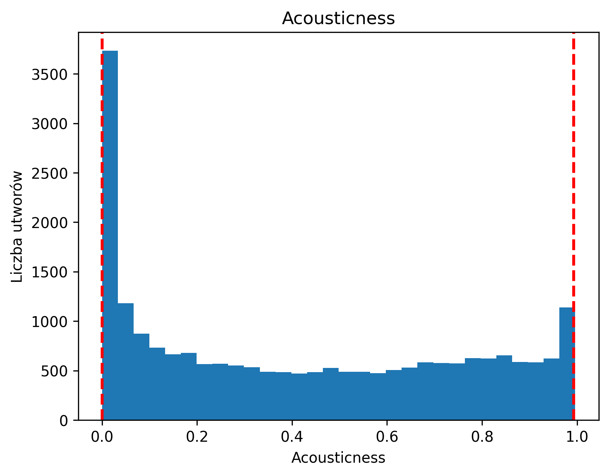

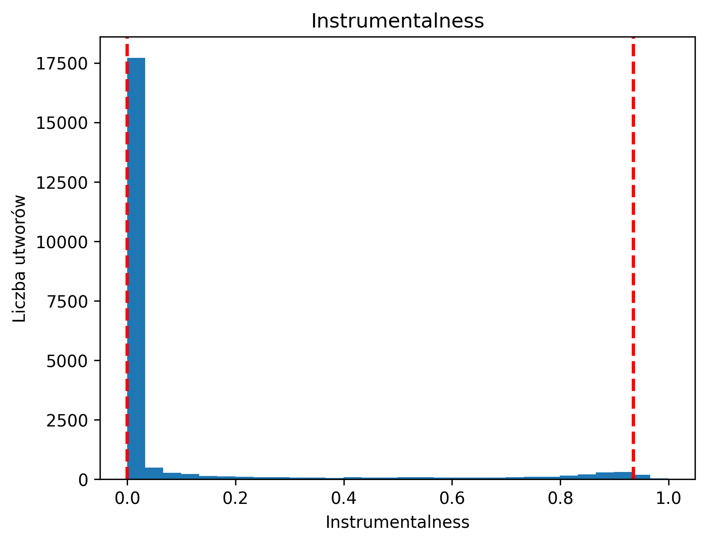

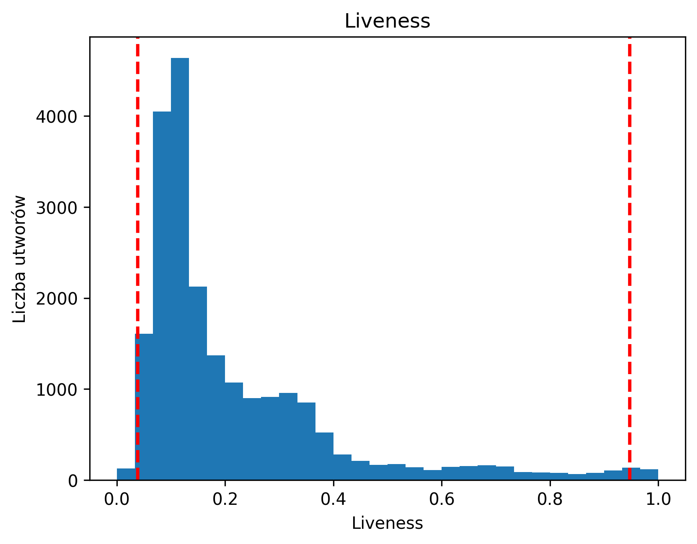

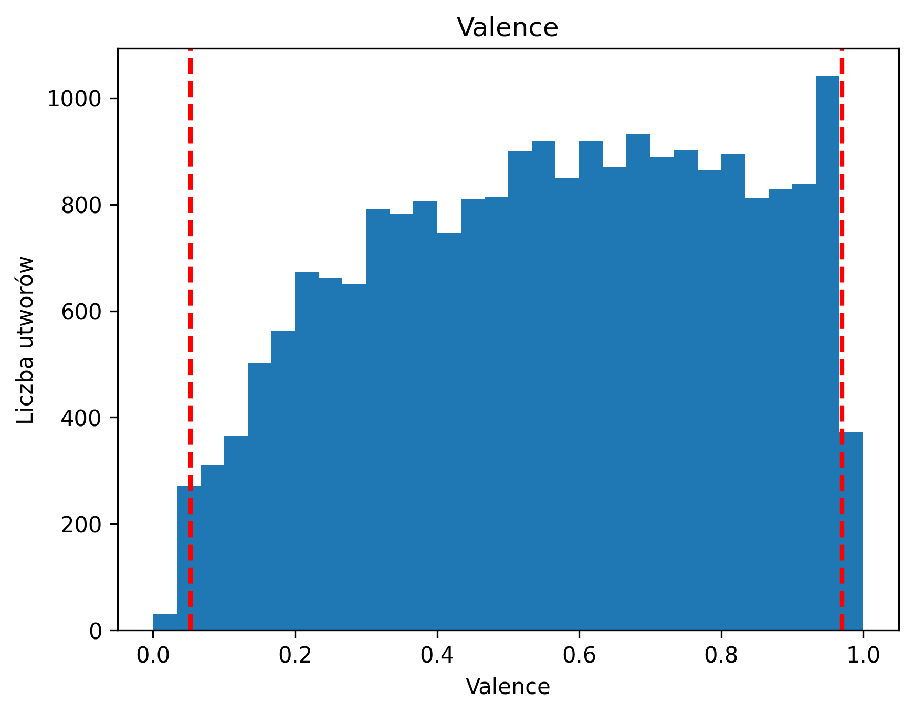

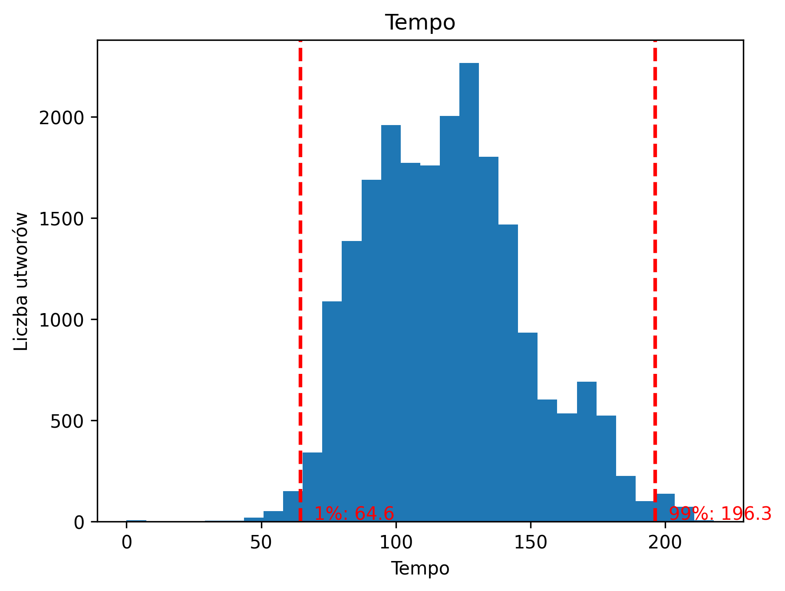

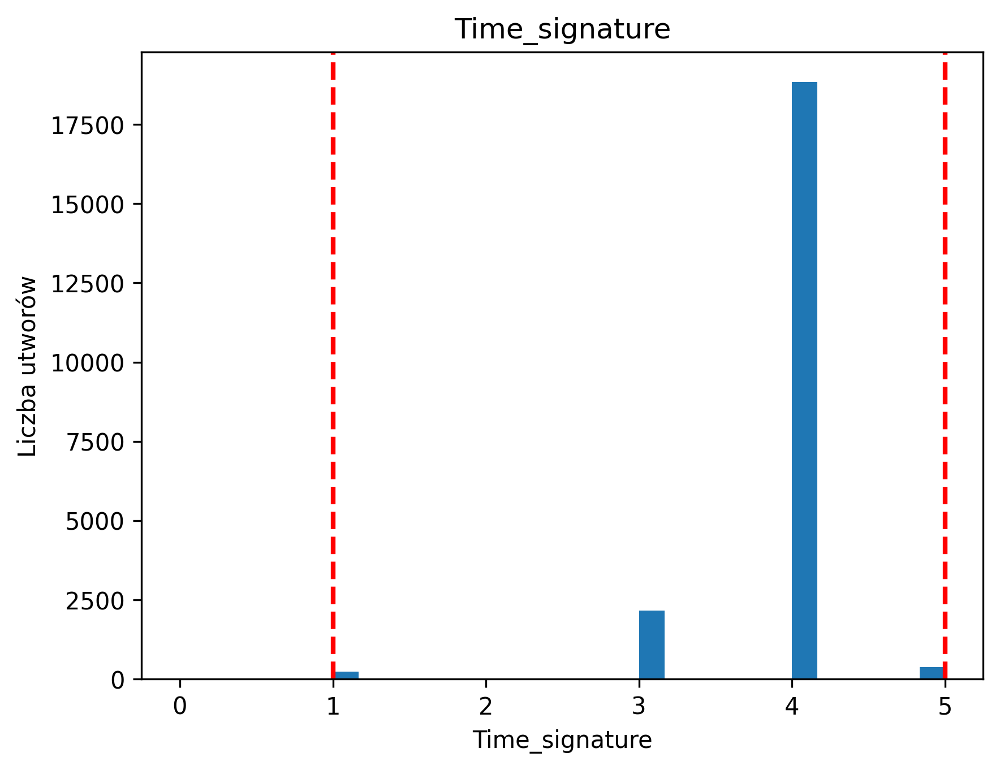

Na podstawie przedstawionych histogramów możemy wnioskować, że nie wszystkie atrybuty niosą istotne informacje dla zadania.

## Transformacja
Aby uprościć strukturę danych, dane z pliku `sessions.jsonl` zostały poddane transformacji.
Wyliczono następujące wartości:
- `advertisementBefore` (określa czy bezpośrednio przed utworem została odtworzona reklama)
- `skipped` (określa czy utwór został pominięty)
- `likedWhilePlaying` (czy podczas odtwarzania utworu został on polubiony)

## Współczynniki korelacji dla atrubutów ciągłych
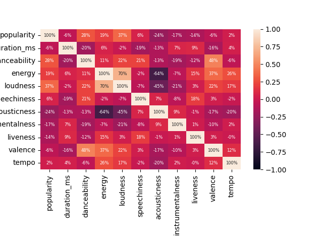

## Współczynniki informacji wzajemnej
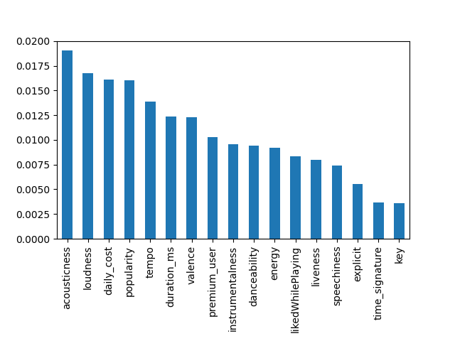 

Po obliczeniu współczynnika informacji wzajemnej między dostarczonymi danymi, a zmienną celu, wynika, że dostarczone dane nie niosą zbyt dużo informacji o zmiennej celu.
Nawet największa wartość współczynnika informacji wzajemnej jest poniżej 2%.

## Wstępnie zdefiniowane danych wejściowych
Przy wstępnej próbie użyto MLPClassifier okazało się, że na poprawę modelu w sposób dość znaczący wpływa personalizacja utworów pod użytkownika, na podstawie jego ulubionych gatunków muzycznych
(`71.23%` vs `59.80%`).
Istotne jest zatem uwzględnienie `favourite_genres`, `genres` w modelu.
Większość innych atrybutów nie niesie wiele informacji i nie wpływa w znaczący sposób na poprawę modelu (potwierdza to wyznaczone wcześniej współczynniki informacji wzajemnych)


# Etap 2

## Modele
- Modele zostały przygotowane w języku Python z wykorzystaniem PyTorch.
- Modele są oparte o perceptrony wielowarstwowe (MLP)
- Do trenowania modeli wykorzystano rdzenie CUDA w GPU Nvidia.

### Proces budowy modelów
#### Przygotowanie danych
Za pomocą skryptu `transformation/transform_sessions.py` dane zostały przeformatowane do uproszczonej postaci. Zawiera ona etykietę mówiącą o tym czy utwór został pominięty, czy nie
#### Etapy przygotowania danych do trenowania
- Wczytanie danych z plików wejściowych
- Łączenie danych w jeden duży zestaw danych
- Wektoryzacja tekstu na liczby za pomocą mechanizmu TF-IDF
- Redukcja wymiarowości za pomocą PCA (Principal Component Analysis)
- Klasteryzacja danych za pomocą algorytmu KMeans
- Kodowanie danych One-hot
- Podział danych na zbiór treningowy i testowy
- Normalizacja danych za pomocą StandardScaler
- Przepróbkowanie danych za pomocą SMOTE (Synthetic Minority Oversampling Technique) aby zrównoważyć klasę mniejszościową w zestawie danych


### Opis budowy modeli
#### Budowa modelu Simple
- Model złożony z  3 warstw
  - Pierwsza warstwa: 50 neuronów, Funkcja aktywacji: ReLU
  - Druga warstwa: 30 neuronów, Funkcja aktywacji: ReLU
  - Trzecia warstwa: 2 neurony
- CrossEntropyLoss i optimizer Adam
- 1000 epok

#### Budowa modelu Advanced
- Model złożony z 4 warstw
  - Pierwsza warstwa: 100 neuronów, Funkcja aktywacji: ReLU
  - Dropout z prawdopodobieństwem 0.5
  - Druga warstwa: 50 neuronów, Funkcja aktywacji: ReLU
  - Dropout z prawdopodobieństwem 0.5
  - Trzecia warstwa: 30 neuronów, Funkcja aktywacji: ReLU
  - Czwarta warstwa: 2 neurony
- CrossEntropyLoss i optimizer Adam
- scheduler ReduceLROnPlateau
- 1000 epok

### Uruchomienie trenowania
Wszystkie kroki trenowania można wykonać używając jednego skryptu:
```bash
DATA_VERSION=<data_version> CUDA_USE_GPU=<cuda_use_gpu> ./prepare_models.sh
```
gdzie:
- `data_version` - wersja danych wejściowych (domyślnie `v2`)
- `cuda_use_gpu` - czy używać GPU (`0` lub `1` - domyślnie `1`)


## Modele
### Simple
Przewiduje czy utwór zostanie pominięty czy nie tylko na podstawie favourite_genres użytkownika i genres utworu

### Advanced
Przewiduje czy utwór zostanie pomięty czy nie na podstawie favourite_genres użytkownika, genres utworu oraz dodatkowych informacji o utworze.


### Porównanie modeli
#### Dane v2:
- Simple: `70.74%`
- Advanced: `73.27%`

#### Dane v3:
- Simple: `63.49%`
- Advanced: `62.23%`


#### Inne próby
##### RandomForest i GradientBoosting
Próby z wykorzystaniem RandomForest i GradientBoosting nie przyniosły zadowalających rezultatów. Ponieważ wykorzystywane trenowanie na CPU ich trenowanie trwało dużo dłużej

## Mikroserwis
Mikroserwis został zaimplementowany w języku Python z wykorzystaniem FastAPI. Jest on udostępniony jako obraz Dockerowy.

#### Uruchomienie mikroserwisu
Aby uruchomić mikroserwis, należy skopiować plik `.env.example` do `.env` i uzupełnić go odpowiednimi wartościami.
```bash
cp .env.example .env
```
Następnie należy zbudować obraz Dockerowy i uruchomić go:
```bash
docker-compose up -d --build
```

### Endpointy

#### Lista modeli
`GET /api/models`

Zwraca dostępne modele (`simple` i `advanced`)

#### Predykcja z wykorzystaniem konkretnej wersji modelu
`POST /api/predict/{model_name}`, gdzie model_name `simple` lub `advanced`

Przykładowe request body:
```json
{
    "track_id": "0qGcYAUhkokluTCAuLUSdY",
    "favourite_genres": [
        "argentine rock"
    ]
}
```
Przykładowy response:
```json
{
    "skipped": false
}
```

#### Predykcja z wykorzystaniem losowej wersji modelu do przeprowadzenia testów A/B
`POST /api/predict/random`
Informacje o predykcji są zapisane do dokumentowej bazy danych MongoDB.
Dane te mogą posłużyć do późniejszej oceny jakości modeli.


### Prezentacja działania mikroserwisu
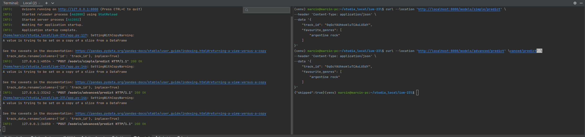