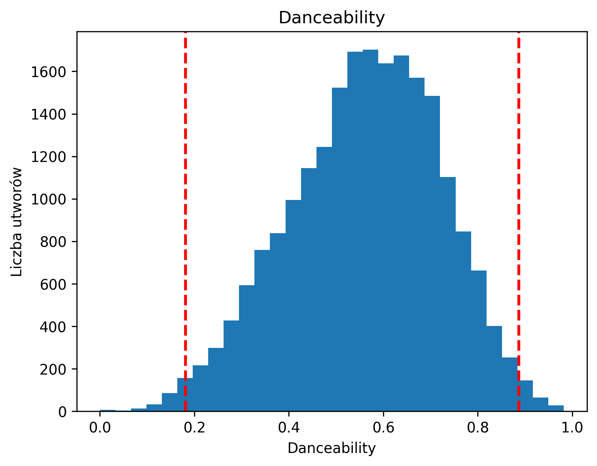

# IUM zadanie 07 wariant 02
- Korneliusz Litman 310804
- Marcin Zasuwa

## Kontekst:
> W ramach projektu wcielamy się w rolę analityka pracującego dla portalu „Pozytywka” –serwisu muzycznego, który swoim użytkownikom pozwala na odtwarzanie ulubionych utworów online. Praca na tym stanowisku nie jest łatwa –zadanie dostajemy w formie enigmatycznego opisu i to do nas należy doprecyzowanie szczegółów tak, aby dało się je zrealizować. To oczywiście wymaga  zrozumienia  problemu,  przeanalizowania  danych,  czasami  negocjacji  z  szefostwem. Same  modele musimy skonstruować tak,  aby gotowe  były do  wdrożenia  produkcyjnego – pamiętając,  że  w  przyszłości  będą  pojawiać  się  kolejne  ich  wersje, z  którymi  będziemy eksperymentować.

## Zadanie
> “Gdybyśmy tylko wiedzieli, kiedy użytkownik będzie chciał przesłuchać bieżący utwór w całości, a kiedy go przewinie – moglibyśmy lepiej zorganizować nasz cache”


## Definicja problemu biznesowego
### Kontekst
Serwis muzyczny Pozytywka umożliwia użytkownikom odtwarzanie utworów. Firma zbiera informacje m.in. dotyczączące artystów, utworów czy sesji użytkowników. W celu zwiększenia wydajności i poprawy doświadczeń użytkowników serwis Pozytywka chce ulepszych organizację cache poprzez przewidywanie, kiedy utwory będą odtwarzane w całości, a które będą przewijane

### Zadanie biznesowe
Opracowanie i wdrożenie modelu predykcyjnego, który na podstawie dostępnych danych i historii użytkowników, będzie w stanie przewidywać prawdopodobieństwo, że użytkownik odtworzy utwór w całości lub go przewinie.

### Biznesowe kryteria sukcesu
wersja 0.0.1 sukcesu: optymalizacja kosztów i podziału slow/medium/Where cryteria
wersja 0.0.2: dobry guess rate na zapytaniach utwór/timestamp? (doprecyzować na chatcie)

- wyższa wydajność cache'u XD
- optymalizacja kosztów ?
- poprawa doświadczeń użytkowników: dzięki szybszemu cache użytkownicy zyskują szybsze i bardziej płynne doświadczenia podczas odtwarzania utworów


## Definicja zadania / zadań modelowania i wszystkich założeń
Zadania modelowania: Model predykcyjny, który na podstawie dostarczonych danych będzie w stanie przewidzieć, czy utwór zostanie odtworzony w całości, czy zostanie przewinięty.


## Analiza danych
### Przegląd struktury dostarczonych danych
Dostaliśmy dane składające się z 5 plików `jsonl`
- `artists.jsonl` zawiera informacje o artystach
- `sessions.jsonl` zawiera informacje o sesjach użytkowników
- `tracks.jsonl` zawiera informacje o utworach
- `track_storage.jsonl` zawiera informacje o tym na jakich klasach pamięci są przechowywane utwory
- `users.jsonl` zawiera informacje o użytkownikach portalu


### Atrybuty danych


#### Wstępne założenia
Aby sprawdzić czy utwór został przesłuchany w całości, czy został pominięty, należy przeanalizować plik `sessions.jsonl`
- podstawowym kryterium analizy jest sprawdzenie czy wystąpił `event_type` *SKIP* pomiędzy `event_type` *PLAY*
- na skipowanie utworów mogą wpływać wartości charakterystyczne dla danych utworów: niektóre utwory mogą być skipowane częściej niż inne
- skipowane utwory mogą też zależeć od preferencji użytkownika np. użytkownik lubi rock, przez co istnieje szansa, że takie utwory będą skipowane przez niego rzadziej


### Analiza za pomocą programów

Do analizy danych wykorzystaliśmy Pythonową bibliotekę `pandas` służącą do analizy danych.

#### Pierwsza wersja
Pierwsza wersja otrzymanych danych zawierała istotne błędy w dużym stopniu utrudniające dalszą analizę.
Większość tych błędów polegała na nullowych i nieprawidłowych wartościach:

##### Raport z analizy
- Artyści (`artists.jsonl`):
    - Wartość -1 dla `id` występuje 494 razy,
    - Brak wartości (`null`) w polu `genres`: 544 wystąpień,
    - Zduplikowane nazwy artystów: 14.

- Sesje (`sessions.jsonl`):

    - Brak wartości (`null`) w polu `event_type`: 167 wystąpień,
    - Brak wartości (`null`) w polu `track_id`: 163 wystąpień,
    - Brak wartości (`null`) w polu `user_id`: 195 wystąpień.

- Utwory (`tracks.jsonl`):

    - Brak wartości (`null`) w polu `id`: 1117 wystąpień,
    - Brak wartości (`null`) w polu `name`: 1083 wystąpień,
    - Brak wartości (`null`) w polu `artist_id`: 1078 wystąpień,
    - Brak wartości (`null`) w polu `popularity`: 1044 wystąpień.

- Użytkownicy (`users.jsonl`):

    - Występuje pole `id` dla jednego rekordu, które nie istnieje dla innych rekordów (wartość pola: -1),
    - Brak wartości (`null`) w polu `favourite_genres`: 5,
    - Brak wartości (`null`) w polu `premium_user`: 1.

- W pliku z danymi o przechowywaniu utworów (`track_storage.jsonl`) nie znaleźliśmy problemów.

#### Druga wersja

##### tracks.jsonl
W danych dalej występują błędy - dla kilku artystów powtarzają się nazwy utworów dla nich samych (występują duplikaty par nazwa utworu - artysta).
Nie jest to sytuacja całkowicie niespotykana, jednak na tyle rzadka, że została uznana za błąd w danych.


Lista duplikatów wraz z ilością wystąpień:
```
Duplicate entries for artist id: 1uNFoZAHBGtllmzznpCI3s and track name: Hold On - 4 occurrences
Duplicate entries for artist id: 6M2wZ9GZgrQXHCFfjv46we and track name: Blow Your Mind (Mwah) - 4 occurrences
Duplicate entries for artist id: 4tpUmLEVLCGFr93o8hFFIB and track name: Atomic - 3 occurrences
Duplicate entries for artist id: 5tOrTQaBRD5yPHqbEwsRn7 and track name: 99 Year Blues - 3 occurrences
Duplicate entries for artist id: 71Ur25Abq58vksqJINpGdx and track name: Blues By Five - Rudy Van Gelder Remaster - 3 occurrences
Duplicate entries for artist id: 0SfsnGyD8FpIN4U4WCkBZ5 and track name: Blah Blah Blah - 3 occurrences
Duplicate entries for artist id: 4VMYDCV2IEDYJArk749S6m and track name: Perros Salvajes - 3 occurrences
Duplicate entries for artist id: 6SLAMfhOi7UJI0fMztaK0m and track name: Rainbow Eyes - 2 occurrences
Duplicate entries for artist id: 0LcJLqbBmaGUft1e9Mm8HV and track name: Chiquitita - 2 occurrences
Duplicate entries for artist id: 44WCHvwXBOMz6nm7Mu2ReO and track name: Mi Verdadero Amor - 2 occurrences
Duplicate entries for artist id: 7knmbOGe07k85GmK50vACB and track name: La machine à rattraper le temps - 2 occurrences
Duplicate entries for artist id: 0WwSkZ7LtFUFjGjMZBMt6T and track name: Your Latest Trick - 2 occurrences
Duplicate entries for artist id: 0iMKZWAsycF13Uu67duuj7 and track name: El Amor En Carro - 2 occurrences
Duplicate entries for artist id: 6bMul6rmRS03x38tWKYifO and track name: Sei un mito - 2 occurrences
Duplicate entries for artist id: 5m8H6zSadhu1j9Yi04VLqD and track name: Hot Fun in the Summertime - 2 occurrences
Duplicate entries for artist id: 07PdYoE4jVRF6Ut40GgVSP and track name: El Arte del Engaño - 2 occurrences
Duplicate entries for artist id: 53XhwfbYqKCa1cC15pYq2q and track name: On Top Of The World - 2 occurrences
Duplicate entries for artist id: 7jdFEYD2LTYjfwxOdlVjmc and track name: Hot Blood - 2 occurrences
Duplicate entries for artist id: 7nzSoJISlVJsn7O0yTeMOB and track name: Summer - 2 occurrences
Duplicate entries for artist id: 1uNFoZAHBGtllmzznpCI3s and track name: Love Yourself - 2 occurrences
Duplicate entries for artist id: 110wHDAsaXDaKKdUztwGlE and track name: מה אברך - 2 occurrences
Duplicate entries for artist id: 2nszmSgqreHSdJA3zWPyrW and track name: Delirio - 2 occurrences
Duplicate entries for artist id: 790FomKkXshlbRYZFtlgla and track name: Ay, DiOs Mío! - 2 occurrences
Duplicate entries for artist id: 5xSx2FM8mQnrfgM1QsHniB and track name: El Primer Dia Sin Ti - 2 occurrences
Duplicate entries for artist id: 6AmG7SNdlV9boPZ7dFVnLY and track name: Animal Trainer - 2 occurrences
Duplicate entries for artist id: 7Hf9AwMO37bSdxHb0FBGmO and track name: Rosas Rojas - 2 occurrences
Duplicate entries for artist id: 6PAt558ZEZl0DmdXlnjMgD and track name: Cocaine - 2 occurrences
Duplicate entries for artist id: 72OaDtakiy6yFqkt4TsiFt and track name: Heart Of Stone - 2 occurrences
Duplicate entries for artist id: 3lcbKPLl0ci2mKRdcP5Etf and track name: Don't Look Any Further - 2 occurrences
Duplicate entries for artist id: 63yrD80RY3RNEM2YDpUpO8 and track name: Mad Hatter - 2 occurrences
Duplicate entries for artist id: 6kACVPfCOnqzgfEF5ryl0x and track name: God's Gonna Cut You Down - 2 occurrences
Duplicate entries for artist id: 7JWJRzjFr2Qt5yB9ondmoq and track name: Quiero Aprender de Memoria - 2 occurrences
Duplicate entries for artist id: 6AmG7SNdlV9boPZ7dFVnLY and track name: Valse triste - 2 occurrences
Duplicate entries for artist id: 630MXrFVMaDvoAnjs8d0Nf and track name: 『果てのない道』 - 2 occurrences
Duplicate entries for artist id: 05Q9xndTxhXhD5trpmTtfU and track name: Volver - 2 occurrences
Duplicate entries for artist id: 0pBIW8SaN8CfC69yGlfmIO and track name: Liù - 2 occurrences
Duplicate entries for artist id: 19HiWVd2g0XyJstBsbW2Qm and track name: Il pescatore - Live - 2 occurrences
Duplicate entries for artist id: 4rOaQg3fasbihPVR4Qft1M and track name: Sumarið er tíminn - 2 occurrences
Duplicate entries for artist id: 70ZTdbPEcEugBNay4MvxfL and track name: Aubrey - 2 occurrences
Duplicate entries for artist id: 3q7HBObVc0L8jNeTe5Gofh and track name: Hustler's Ambition - 2 occurrences
Duplicate entries for artist id: 34PLzyi7CdXUekiLHYyqXq and track name: The Safety Dance - 2 occurrences
Duplicate entries for artist id: 54R6Y0I7jGUCveDTtI21nb and track name: Ma Baker - 2 occurrences
Duplicate entries for artist id: 5xUf6j4upBrXZPg6AI4MRK and track name: Black Hole Sun - 2 occurrences
Duplicate entries for artist id: 1YzCsTRb22dQkh9lghPIrp and track name: It's Easy to Remember - 2 occurrences
Duplicate entries for artist id: 3HL1CyOnDLFJo1Rr8YBlKy and track name: Nessuno - 2 occurrences
Duplicate entries for artist id: 64mPnRMMeudAet0E62ypkx and track name: Too Many Puppies - 2 occurrences
Duplicate entries for artist id: 0DBF33ctUe4yhxKP3eTcCt and track name: Povo que lavas no rio - 2 occurrences
Duplicate entries for artist id: 2NteKKMj3takKR3ABTd279 and track name: Malam Pertama - 2 occurrences
Duplicate entries for artist id: 2aVHDjRHRM7dcFkGwahXLG and track name: It Was a Very Good Year - 2 occurrences
Duplicate entries for artist id: 72JEwd3EjDEwTLypkFYJn9 and track name: (Ghost) Riders In the Sky - Digitally Remastered, 1996 - 2 occurrences
Duplicate entries for artist id: 0Suv0tRrNrUlRzAy8aXjma and track name: What Is Love - 7" Mix - 2 occurrences
Duplicate entries for artist id: 0cQuYRSzlItquYxsQKDvVc and track name: Share the Land - 2 occurrences
Duplicate entries for artist id: 3o13BpwuBBj106YoNIoUrW and track name: Prizraky - 2 occurrences
Duplicate entries for artist id: 0awl5piYwO0CDTHEkCjUhn and track name: Am I Wrong - 2 occurrences
Duplicate entries for artist id: 0z4gvV4rjIZ9wHck67ucSV and track name: Right Now (Na Na Na) - 2 occurrences
Duplicate entries for artist id: 6AmG7SNdlV9boPZ7dFVnLY and track name: The Harlequinade Ballet / Terry's Theme (Eternally) / Moon Dance - 2 occurrences
Duplicate entries for artist id: 3IYUhFvPQItj6xySrBmZkd and track name: Up Around The Bend - 2 occurrences
Duplicate entries for artist id: 0j26rQ1q8emYPBLonXtEJ9 and track name: Taksidiara Psihi - 2 occurrences
Duplicate entries for artist id: 41ESHLayJ5sDKjAOv6cMhe and track name: Amigo Mío (Homenaje a Juan Gabriel) - 2 occurrences
Duplicate entries for artist id: 3Z6IRCo7umuk8K2XQy0ZDj and track name: Year 3000 - 2 occurrences
Duplicate entries for artist id: 4KtyUYo9zaM9YggIVc7uxx and track name: Der Mussolini - 2 occurrences
Duplicate entries for artist id: 1KkuALrf8T61dUSezl80Y4 and track name: 把悲傷留給自己 - 2 occurrences
Duplicate entries for artist id: 3ienC90A5I1X3irDyQoqWZ and track name: 襟裳岬 - 2 occurrences
Duplicate entries for artist id: 7bu3H8JO7d0UbMoVzbo70s and track name: Boys Don't Cry - 2 occurrences
Duplicate entries for artist id: 3TkWygOTDBZXAdFDh9HOkG and track name: My Girl (Gone, Gone, Gone) - 2 occurrences
Duplicate entries for artist id: 0vn7UBvSQECKJm2817Yf1P and track name: Everyday - 2 occurrences
Duplicate entries for artist id: 3VEG6gxFIMfl4Cdog26avS and track name: Very Early - 2 occurrences
Duplicate entries for artist id: 7CIW23FQUXPc1zebnO1TDG and track name: Resolution - 2 occurrences
Duplicate entries for artist id: 6I3M904Y9IwgDjrQ9pANiB and track name: Don't Make Me Wait for Love - 2 occurrences
Duplicate entries for artist id: 6eUKZXaKkcviH0Ku9w2n3V and track name: Sing - 2 occurrences
Duplicate entries for artist id: 0oSGxfWSnnOXhD2fKuz2Gy and track name: John, I'm Only Dancing - Original Single Version, 2012 Remaster - 2 occurrences
Duplicate entries for artist id: 5wVZvTmFDwXj7ZOc4AQZ7H and track name: Itkisitkö onnesta? - 2 occurrences
Duplicate entries for artist id: 1uNFoZAHBGtllmzznpCI3s and track name: Sorry - 2 occurrences
Duplicate entries for artist id: 79nkC8XZ5ohEVU0Xlf5Ael and track name: 真夏の果実 - 2 occurrences
Duplicate entries for artist id: 1zuJe6b1roixEKMOtyrEak and track name: The Best - 2 occurrences
Duplicate entries for artist id: 0t2xdTxRXnffsmpMamH8Ls and track name: Argumento - 2 occurrences
Duplicate entries for artist id: 6I3M904Y9IwgDjrQ9pANiB and track name: Innocence - 2 occurrences
Duplicate entries for artist id: 3IYUhFvPQItj6xySrBmZkd and track name: Fortunate Son - 2 occurrences
Duplicate entries for artist id: 2kreKea2n96dXjcyAU9j5N and track name: Fire - 2 occurrences
Duplicate entries for artist id: 6hnWRPzGGKiapVX1UCdEAC and track name: Shake - 2 occurrences
Duplicate entries for artist id: 2kreKea2n96dXjcyAU9j5N and track name: I'm So Excited - 2 occurrences
Duplicate entries for artist id: 3alW3LYQS8K29z8C8NSLIX and track name: Even Now - 2 occurrences
Duplicate entries for artist id: 5pnSNZZRyYViu2n58Zlw1J and track name: Aku Bukan Bang Toyib - 2 occurrences
Duplicate entries for artist id: 2mUI4K6csTQd3jieswcmiI and track name: Mi Mundo - 2 occurrences
Duplicate entries for artist id: 2taCySpDIEEa2mvo2k7xkH and track name: La gatta - 2 occurrences
Duplicate entries for artist id: 0P2p1bqVyP2EgqubwjTBUJ and track name: Alexandrie Alexandra - 2 occurrences
Duplicate entries for artist id: 205i7E8fNVfojowcQSfK9m and track name: Take It - 2 occurrences
Duplicate entries for artist id: 3utZ2yeQk0Z3BCOBWP7Vlu and track name: Melodie - 2 occurrences
Duplicate entries for artist id: 5wPoxI5si3eJsYYwyXV4Wi and track name: She Wants To Move - 2 occurrences
Duplicate entries for artist id: 4P4cATtI7ozt4k4oKho4uz and track name: Otan Ta Hronia Sou Perasoun - 2 occurrences
Duplicate entries for artist id: 6wWVKhxIU2cEi0K81v7HvP and track name: LOS - 2 occurrences
Duplicate entries for artist id: 0LcJLqbBmaGUft1e9Mm8HV and track name: Angeleyes - 2 occurrences
Duplicate entries for artist id: 6vbv2PLT1BDbxQWHg1OYIe and track name: Luokseni jääthän - Love Me Forever - 2 occurrences
Duplicate entries for artist id: 2XjqKvB2Xz9IdyjWPIHaXi and track name: 本能 - 2 occurrences
Duplicate entries for artist id: 1QAJqy2dA3ihHBFIHRphZj and track name: Nothing's Gonna Hurt You Baby - 2 occurrences
Duplicate entries for artist id: 4TKTii6gnOnUXQHyuo9JaD and track name: Soak Up The Sun - 2 occurrences
Duplicate entries for artist id: 6gr9N1ZxcYFJJHRBxkveUX and track name: Applausi - 2 occurrences
Duplicate entries for artist id: 2wPsNCwhEGb0KvChZ5DD52 and track name: Nala Damayandhi - 2 occurrences
Duplicate entries for artist id: 5TDssiSO1YPd3BINGZx3XP and track name: Memphis Blues - 2 occurrences
Duplicate entries for artist id: 3dkbV4qihUeMsqN4vBGg93 and track name: Simply Beautiful - 2 occurrences
Duplicate entries for artist id: 1dfeR4HaWDbWqFHLkxsg1d and track name: Don't Stop Me Now - 2 occurrences
Duplicate entries for artist id: 3Ebn7mKYzD0L3DaUB1gNJZ and track name: The City of Chicago - 2 occurrences
Duplicate entries for artist id: 13saZpZnCDWOI9D4IJhp1f and track name: LDN - 2 occurrences
Duplicate entries for artist id: 0t4VVR2T9Sb0z3NdDdEU6S and track name: Jazz Lips - 2 occurrences
Duplicate entries for artist id: 2jMYTBTCSNYaCYy54mLc6I and track name: Lejos de las leyes de los hombres - 2008 Remaster - 2 occurrences
Duplicate entries for artist id: 7jrRQZg4FZq6dwpi3baKcu and track name: Rock Do Diabo - 2 occurrences
Duplicate entries for artist id: 14L5rpGTLVUz1pD8fUeJB1 and track name: Pack Up - 2 occurrences
Duplicate entries for artist id: 12d4iIvTOk7JkI6ecvc3ca and track name: In America - 2 occurrences
Duplicate entries for artist id: 4xQFKlQXtzYxfZOnk799m2 and track name: Tanta Vida en Cuatro Versos - 2 occurrences
Duplicate entries for artist id: 1uNFoZAHBGtllmzznpCI3s and track name: Yummy - 2 occurrences
Duplicate entries for artist id: 2HBbky0Z08ZcCKVsXWbNE4 and track name: When - 2019 - Remaster - 2 occurrences
Duplicate entries for artist id: 5schNIzWdI9gJ1QRK8SBnc and track name: Small Things - 2 occurrences
Duplicate entries for artist id: 2x8vG4f0HYXzMEo3xNsoiI and track name: Bibi und Tina Lied - 2 occurrences
Duplicate entries for artist id: 6dHozHCXF9TVywL2ex4uun and track name: 我比你更難過 - 2 occurrences
Duplicate entries for artist id: 5hLLs4nJdYwC3187Zv6HkI and track name: Fagyi - 2 occurrences
Duplicate entries for artist id: 1hCZVC6ka2eOpzKUtNgC4k and track name: Tanecnice z Lucnice - 2 occurrences
Duplicate entries for artist id: 0llYwFIMgF9Jzmp4ZY7wbr and track name: 蕾(つぼみ) - 2 occurrences
Duplicate entries for artist id: 6hN9F0iuULZYWXppob22Aj and track name: Street Fighting Years - Remastered 2002 - 2 occurrences
Duplicate entries for artist id: 3wYyutjgII8LJVVOLrGI0D and track name: Changing All Those Changes - 2 occurrences
Duplicate entries for artist id: 0gPgE6wLLiPnrakh9WcsdQ and track name: Her Sevgide Bin Ah Ettim - 2 occurrences
Duplicate entries for artist id: 1qma7XhwZotCAucL7NHVLY and track name: 【es】~Theme of es~ - 2 occurrences
Duplicate entries for artist id: 2l35CQqtYRh3d8ZIiBep4v and track name: Classic - 2 occurrences
Duplicate entries for artist id: 2elBjNSdBE2Y3f0j1mjrql and track name: 稻香 - 2 occurrences
Duplicate entries for artist id: 08GQAI4eElDnROBrJRGE0X and track name: That's All for Everyone - 2015 Remaster - 2 occurrences
Duplicate entries for artist id: 67hb7towEyKvt5Z8Bx306c and track name: Walking On A Dream - 2 occurrences
Duplicate entries for artist id: 1yqxFtPHKcGcv6SXZNdyT9 and track name: 17 - 2 occurrences
Duplicate entries for artist id: 5vBSrE1xujD2FXYRarbAXc and track name: King - 2 occurrences
Duplicate entries for artist id: 3Edq1eT7m7GX0PvHW7yEDF and track name: Súbete a Mi Moto - 2 occurrences
Duplicate entries for artist id: 3jOstUTkEu2JkjvRdBA5Gu and track name: El Scorcho - 2 occurrences
Duplicate entries for artist id: 4w3QqrcmBv8dasemwBXmxf and track name: The King of Rock 'N' Roll - 2 occurrences
Duplicate entries for artist id: 4CYeVo5iZbtYGBN4Isc3n6 and track name: Straight Through The Heart - 2 occurrences
Duplicate entries for artist id: 6D7h7R79IZjqJC2GM2wzyY and track name: Boogie Nights - 2 occurrences
Duplicate entries for artist id: 1h8YIw9HLr6E8gdXVDRbVJ and track name: Look Away - 2 occurrences
Duplicate entries for artist id: 5zaXYwewAXedKNCff45U5l and track name: Son of a Preacher Man - 2 occurrences
Duplicate entries for artist id: 6VimeBsWv0rmWzxd6roZZC and track name: Leflaur Leflah Eshkoshka - 2 occurrences
Duplicate entries for artist id: 19eLuQmk9aCobbVDHc6eek and track name: I've Got a Feeling I'm Falling - 2 occurrences
Duplicate entries for artist id: 04MtOUkmIDC4LAxDDBjrOY and track name: Het Is Koud Zonder Jou - 2 occurrences
Duplicate entries for artist id: 24DQLSng7bKZD4GXLIaQbv and track name: They Can't Take That Away from Me - 2 occurrences
Duplicate entries for artist id: 6AmG7SNdlV9boPZ7dFVnLY and track name: Overture / Unveiling the Monument - 2 occurrences
Duplicate entries for artist id: 5PSrkk7FbeWqTFMdVUuI4j and track name: Du Er Ikke Som De Andre Pi'r - 2 occurrences
Duplicate entries for artist id: 3Y10boYzeuFCJ4Qgp53w6o and track name: I Don't Feel Like Dancin' - 2 occurrences
Duplicate entries for artist id: 0EdvGhlC1FkGItLOWQzG4J and track name: What I Got - 2 occurrences
Duplicate entries for artist id: 0cA5Tg15TwARIRZeiNT1RO and track name: Heart Hotels - 2 occurrences
Duplicate entries for artist id: 4vWQjpI68kWBNkXOEbi1D6 and track name: Es lebe der Sport - 2 occurrences
Duplicate entries for artist id: 6P7H3ai06vU1sGvdpBwDmE and track name: Black Cow - 2 occurrences
Duplicate entries for artist id: 67ea9eGLXYMsO2eYQRui3w and track name: I Can See For Miles - Incl. Charles Atlas Commercial - 2 occurrences
Duplicate entries for artist id: 1vyhD5VmyZ7KMfW5gqLgo5 and track name: Morado - 2 occurrences
Duplicate entries for artist id: 44nb9BaqV2jVvxKCaXHwlP and track name: Cómo Te Va Mi Amor - 2 occurrences
Duplicate entries for artist id: 3EhbVgyfGd7HkpsagwL9GS and track name: I Love the Dead - 2 occurrences
Duplicate entries for artist id: 11hIqBsGRPztdjBHCSLClX and track name: If You're Not The One - 2 occurrences
Duplicate entries for artist id: 6AmG7SNdlV9boPZ7dFVnLY and track name: Afternoon - 2 occurrences
Duplicate entries for artist id: 0rJcrQfLLtWSJAKbZPk6NV and track name: Don't Stop The Music - 2 occurrences
Duplicate entries for artist id: 3JsMj0DEzyWc0VDlHuy9Bx and track name: The Logical Song - 2 occurrences
Duplicate entries for artist id: 3t2iKODSDyzoDJw7AsD99u and track name: Bibi Blocksberg Lied - 2 occurrences
Duplicate entries for artist id: 2XnnxQzxFZG8qEPjakokPM and track name: The Setup - 2 occurrences
Duplicate entries for artist id: 7mAczrzrX3yC9yix8DM1YV and track name: 君がいなければ - 2 occurrences
Duplicate entries for artist id: 49e4v89VmlDcFCMyDv9wQ9 and track name: Nevertheless (I'm In Love With You) - 2 occurrences
Duplicate entries for artist id: 1Hu58yHg2CXNfDhlPd7Tdd and track name: 我等到花兒也謝了 - 2 occurrences
Duplicate entries for artist id: 6zFYqv1mOsgBRQbae3JJ9e and track name: New York State of Mind - 2 occurrences
Duplicate entries for artist id: 4OiCK9NnTWhakDIG57uBUA and track name: Como Un Sol - 2 occurrences
Duplicate entries for artist id: 0dmPX6ovclgOy8WWJaFEUU and track name: Abzug - 2009 Remaster - 2 occurrences
Duplicate entries for artist id: 1co4F2pPNH8JjTutZkmgSm and track name: You Sound Like You're Sick - 2002 Remaster - 2 occurrences
Duplicate entries for artist id: 1gyBRbQACz4JJX2HRROigK and track name: Edo - 2 occurrences
Duplicate entries for artist id: 40Yq4vzPs9VNUrIBG5Jr2i and track name: Siva - Remastered 2011 - 2 occurrences
Duplicate entries for artist id: 19eLuQmk9aCobbVDHc6eek and track name: Rockin' Chair - Live - 2 occurrences
Duplicate entries for artist id: 6UcJxoeHWWWyT5HZP064om and track name: No Diggity - 2 occurrences
Duplicate entries for artist id: 5vBSrE1xujD2FXYRarbAXc and track name: If You're Over Me - 2 occurrences
Duplicate entries for artist id: 27rXetqqGSi2spXzggwehc and track name: Hold Me Now - 2 occurrences
Duplicate entries for artist id: 2m62cc253Xvd9qYQ8d2X3d and track name: Gemini - 2 occurrences
Duplicate entries for artist id: 7wOZy3KdFVVINgNFFxkxwO and track name: Dia Y Noche Pienso En Ti - 2 occurrences
Duplicate entries for artist id: 63gvl4egwBtz2czz3aENGa and track name: Hari Om Hari - 2 occurrences
Duplicate entries for artist id: 1PCZpxHJz7WAMF8EEq8bfc and track name: Mr. Tambourine Man - 2 occurrences
Duplicate entries for artist id: 1YEGETLT2p8k97LIo3deHL and track name: Mmm Mmm Mmm Mmm - 2 occurrences
Duplicate entries for artist id: 4etuCZVdP8yiNPn4xf0ie5 and track name: De Niña a Mujer - 2 occurrences
Duplicate entries for artist id: 0c3RL3vVEgfxD6VBv7CGak and track name: A Year In The Life - 2003 Remastered Version - 2 occurrences
Duplicate entries for artist id: 35pV6EUbherudlvAftoueR and track name: April In Portugal - 2 occurrences
```

##### track_storage.jsonl
W porównaniu do pierwszej wersji wszystkie wpisy `track_storage.jsonl` z `track_id` mają odpowiadający id z `tracks.json`

##### sessions.jsonl
- Dane zawierające eventy w sesjach wydają się być poprawne: dla każdego wpisu podany jest odpowiedni `track_id`, który ma odzwierciedlenie w pliku tracks.json (oprócz 3853 eventów typu ADVERTISTMENT lub BUY_PREMIUM, które go nie wymagają)

- Liczba event_type SKIP wynosi 4090, co sugeruje, że odpowiednia wielkość danych wydaje się być zachowana

- Kolejna analiza pokazała, że każdy event_type SKIP jest dla danej sesji poprzedzony (niekoniecznie bezpośrednio) event_type typu PLAY. Czyli dane w tym zakresie wydają się być poprawne. Ta cecha będzie miała kluczowe znaczenie dla naszego zadania (pozwala określić)

- Kolejna analiza pokazała statystyki po jakim czasie utwory są najczęściej pomijane.
```
When track was skipped:
mean: 132.50 seconds
median: 125.88 seconds
min: 0.09 seconds
max: 1057.39 seconds
std: 90.49 seconds

```
Przygotowaliśmy histogram dla przedstawionych danych:


##### tracks.jsonl
Następnie przygotowaliśmy statystyki długości trwania utworów:
```
count    21608
mean       228.06 seconds
std        112.11 seconds
min          4.00 seconds
25%        176.74 seconds
50%        216.51 seconds
75%        262.65 seconds
max       4120.26 seconds
```

Zaznaczyliśmy je na wykresie (zaznaczając dodatkowo 1 i 99 percentyl)


Przygotowaliśmy kolejne histogramy dla kolejnych danych:





Na podstawie przedstawionych histogramów możemy wnioskować, że nie wszystkie atrybuty niosą istotne informacje dla zadania.


